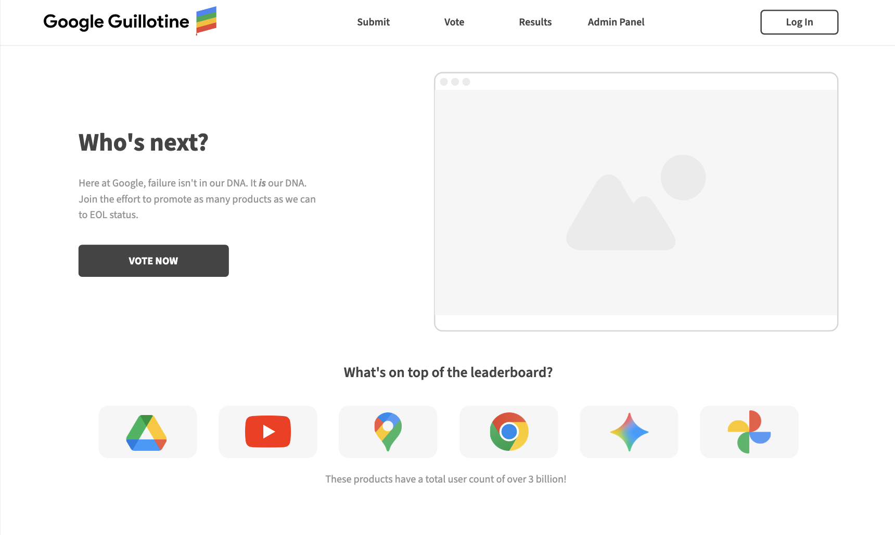

## What is the theme?
Google Guillotine is a satirical web app that imagines what it might look like if Google users themselves could vote on which product or service should be shut down next. It's a reversal of "Killed by Google" (and heavily inspired by), turning the concept from a memorial site for discontinued products into a decision board for their executions.

The website will be built from scratch using pure HTML, CSS, and JavaScript with no frontend frameworks or libraries. It will use AWS services such as Lambda, API Gateway, and DynamoDB to handle data storage and retrieval. The tone of the site is intentionally satirical, presented as if it were a tool used by a department at Google that specifically kills their own products and services.

## What is it going to do?
Google Guillotine will allow users to participate in a decision process about which Google products to kill. Visitors to the site can nominate products for consideration, vote on existing nominations, and view a live list of those that have already been killed. Each interaction communicates with AWS to store, update, and retrieve data.

The main pages will include:
- **Landing Page (index.html):** Introduces the project and links to the other pages.
- **Submission Page (submit.html):** Contains a form where users can propose a product to be killed, including the product name and a short reasoning. Submitted data is sent to AWS.
- **Voting Page (vote.html):** Displays all active products and allows users to vote on which ones should be killed next. Votes update dynamically through AWS Lambda functions.
- **Results Page (results.html):** Shows products that have already been killed.
- **Admin Page (admin.html):** Allows data deletion or resets, giving full CRUD functionality.

## Who is the target audience?
The project is aimed at students, developers, and anyone  familiar with Google's long history of starting and ending projects. It's designed to be lighthearted and not to be taken seriously, offering a way to interact with real backend systems while making fun of corporate decision making.

## What sort of data will it manage?
All the site's data will be user generated and stored dynamically through AWS. This includes:
- Product names submitted by users
- Short text reasons explaining why the product should be killed
- Vote counts for each active product
- Status flags indicating whether a product is alive or killed
- Timestamps for when nominations and executions occur

No personal or identifying information will be collected. The data will be stored in a DynamoDB table and accessed through AWS Lambda functions via API Gateway.

## Stretch Goals
Once the main functionality is implemented, several enhancements could make the project more filled out:
- **Realtime Updates:** Implement polling or WebSocket connections so votes and results update live without refreshing
- **Visualizations:** Use a small JavaScript chart to display the most voted products over time
- **Resurrection Feature:** Allow users to revive previously killed products for a second chance
- **New Products:** Share ideas for brand new products with a set lifespan or to be killed once a certain user count is met

## Project Wireframe

